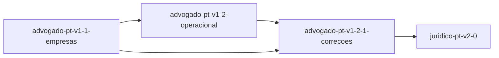

# Roadmap — advogado-pt

<!-- AUTO-GERADO por dev-spec — não editar à mão. -->

**Progresso: 100%** ▰▰▰▰▰▰▰▰▰▰ · 4/4 features completas · 137/137 tasks feitas

_Velocidade: 85.75 ponto(s)/dia útil — 137 tarefa(s), 343 ponto(s) concluídos desde 2026-10-03 (últimos 28 dias)_

Legenda: ✅ feito · 🟡 em curso · ⛔ bloqueada · 📋 planeada · ⬜ por começar

## ▶ A seguir
Todas as features completas 🎉

## Features

| | Feature | Tracks | Fase | % | Tasks | Deps | Próxima | Previsão |
|---|---|---|---|---|---|---|---|---|
| ✅ | [advogado-pt-v1-1-empresas](./advogado-pt-v1-1-empresas/requirements.md) | core +tdd | concluída | 100% | 28/28 | — | — | — |
| ✅ | [advogado-pt-v1-2-1-correcoes](./advogado-pt-v1-2-1-correcoes/requirements.md) | core +tdd +sec | concluída | 100% | 41/41 | advogado-pt-v1-2-operacional ✓, advogado-pt-v1-1-empresas ✓ | — | — |
| ✅ | [advogado-pt-v1-2-operacional](./advogado-pt-v1-2-operacional/requirements.md) | core +tdd | concluída | 100% | 30/30 | advogado-pt-v1-1-empresas ✓ | — | — |
| ✅ | [juridico-pt-v2-0](./juridico-pt-v2-0/requirements.md) | core +tdd +ai +privacy | concluída | 100% | 38/38 | advogado-pt-v1-2-1-correcoes ✓ | — | — |

## Dependências

## ⚠ Precisa de atenção

_Nada a assinalar ✓_

## Backlog (planeadas, ainda sem spec)

_(vazio)_
