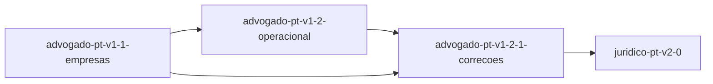

# Roadmap — advogado-pt

<!-- AUTO-GERADO por dev-spec — não editar à mão. -->

**Progresso: 80%** ▰▰▰▰▰▰▰▰▱▱ · 2/4 features completas · 92/137 tasks feitas

_Velocidade: 229 ponto(s)/dia útil — 92 tarefa(s), 229 ponto(s) concluídos desde 2026-10-03 (últimos 28 dias)_

Legenda: ✅ feito · 🟡 em curso · ⛔ bloqueada · 📋 planeada · ⬜ por começar

## ▶ A seguir
- **advogado-pt-v1-2-1-correcoes** (core +tdd +sec) — próxima #33 Testes em falta (`contarPrazo`, custas, Se

## Features

| | Feature | Tracks | Fase | % | Tasks | Deps | Próxima | Previsão |
|---|---|---|---|---|---|---|---|---|
| ✅ | [advogado-pt-v1-1-empresas](./advogado-pt-v1-1-empresas/requirements.md) | core +tdd | concluída | 100% | 28/28 | — | — | — |
| 🟡 | [advogado-pt-v1-2-1-correcoes](./advogado-pt-v1-2-1-correcoes/requirements.md) | core +tdd +sec | em execução | 88% | 34/41 | advogado-pt-v1-2-operacional ✓, advogado-pt-v1-1-empresas ✓ | #33 Testes em falta (`contarPrazo`, custas, Se | 2026-10-05 |
| ✅ | [advogado-pt-v1-2-operacional](./advogado-pt-v1-2-operacional/requirements.md) | core +tdd | concluída | 100% | 30/30 | advogado-pt-v1-1-empresas ✓ | — | — |
| ⛔ | [juridico-pt-v2-0](./juridico-pt-v2-0/requirements.md) | core +tdd +ai +privacy | tarefas prontas | 30% | 0/38 | advogado-pt-v1-2-1-correcoes ✗ | bloqueada | 2026-10-06 |

Previsão = pontos por fazer ÷ velocidade, em dias úteis (±25%) · `_Size: XS|S|M|L|XL_` numa tarefa = 1/2/3/5/8 pontos; uma tarefa sem tamanho conta como a mediana da sua feature (senão M) · uma feature à espera de uma dependência começa depois da previsão dessa.

## Dependências

## ⚠ Precisa de atenção

- **juridico-pt-v2-0** — bloqueada por advogado-pt-v1-2-1-correcoes

## Backlog (planeadas, ainda sem spec)

_(vazio)_
