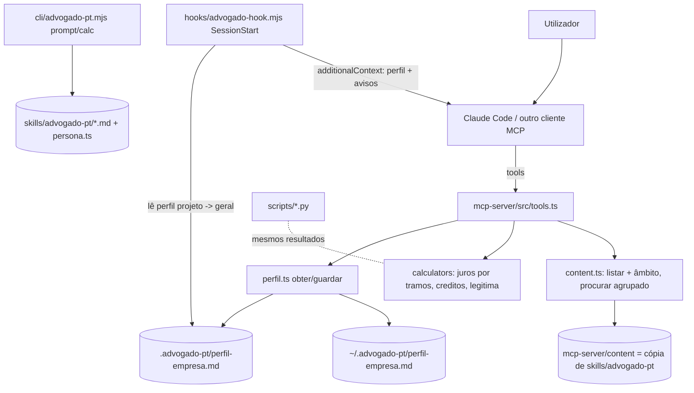

# Design: advogado-pt v1.1 empresas

## Visão Geral
Cinco frentes sobre a arquitetura existente, sem módulos novos de infraestrutura:

1. **Correções (US-1)** — o template de cobrança passa a dizer que a carta **não** interrompe a prescrição; a calculadora de juros deixa a taxa única e passa a uma tabela semestral (2.º sem. 2013 → 2.º sem. 2026) com divisão em tramos e memória de cálculo, nos dois lados (Python e TS).
2. **Método (US-2)** — cada template ganha `## Antes de enviar — verificar`; templates e referências ganham `Âmbito: nacional|ue|misto`; `content.ts` passa a ler o âmbito e as tools de listagem mostram-no. Um teste de estrutura trava regressões.
3. **Qualquer empresa (US-3)** — persona genérica em todos os pontos onde está copiada; **perfil da empresa guardado em ficheiro** (projeto → geral), carregado pelo hook SessionStart e por duas tools MCP; 4 referências, 17 templates, 2 playbooks, 3 checklists e 3 commands novos.
4. **Calculadoras (US-4)** — `creditos_laborais` e `legitima`, Python + TS + tool + CLI.
5. **Distribuição (US-5)** — `cli prompt <nome>`, pesquisa agrupada por tipo, exemplo trabalhado no README.

Decisão-chave: o perfil da empresa vive num ficheiro Markdown simples (`campo: valor`) que o utilizador pode ler e editar, em `<projeto>/.advogado-pt/perfil-empresa.md` com fallback para `~/.advogado-pt/perfil-empresa.md` — funciona no Claude Code (hook) e em qualquer cliente MCP (tools), sem estado no servidor.

## Arquitetura


## Reutilização e Integração
| Tipo | O quê | Onde (caminho) | Porquê / notas |
|---|---|---|---|
| Estender | Calculadora de juros (tabela semestral, tramos, tipo `comercial-geral`, memória) | `mcp-server/src/calculators/juros.ts`, `skills/advogado-pt/scripts/juros_mora.py` | Mesmo módulo; `calcularJuros` mantém nome e parâmetros, troca `taxa` por `tramos` |
| Estender | Leitura de conteúdo: `lerAmbito`, `listarComAmbito`, README excluído, `ambito` em `procurar` | `mcp-server/src/content.ts` | O comentário de `listar` já dizia "excluindo READMEs" mas o código não o fazia — corrigido |
| Estender | Tools de listagem, procura, juros + 4 tools novas | `mcp-server/src/tools.ts` | Mesmo padrão `registerTool` + `texto()` + `AVISO` |
| Estender | Hook SessionStart com perfil | `hooks/advogado-hook.mjs` | Continua sem dependências e fail-open; lê `CLAUDE_PROJECT_DIR`/cwd, sem stdin |
| Estender | CLI: `prompt`, `calc creditos`, `calc legitima`, memória nos juros | `cli/advogado-pt.mjs` | `prompt` lê os `.md` da skill e a persona do `persona.ts` (fonte versionada) — não precisa de build |
| Estender | Testes de estrutura | `mcp-server/test/plugin.test.mjs`, `calculators.test.mjs`, `hooks.test.mjs`, `scripts/test_scripts.py` | Mesmo runner; novo `perfil.test.mjs` |
| Reutilizar | `formatarEuros`, `parseData`, `AVISO` | `calculators/format.ts`, `tools.ts` | — |
| Reutilizar | Pipeline de build (bundle + tsc + esbuild) | `mcp-server/scripts/*` | Conteúdo novo entra automaticamente em `content/` |
| Novo | `perfil.ts` (ler, fundir, gravar perfil) | `mcp-server/src/perfil.ts` | Não há módulo de estado/ficheiros do utilizador; pesquisado `content.ts` (só leitura do conteúdo empacotado) |
| Novo | `creditos.ts`/`creditos_laborais.py`, `legitima.ts`/`legitima.py` | `calculators/`, `scripts/` | Nenhuma calculadora existente cobre férias/subsídios ou quotas sucessórias (`compensacao`, `selo` são outros cálculos) |
| Novo | 4 referências, 17 templates, 2 playbooks, 3 checklists, 3 commands | `skills/advogado-pt/**`, `commands/` | Lacunas medidas por `grep` (ex.: 0 menções de CAAD, assédio, Banco de Portugal) |

**Fronteiras de módulos:** calculadoras puras não leem ficheiros; `perfil.ts` é o único código do servidor que escreve, e só no nome fixo `.advogado-pt/perfil-empresa.md`; o hook não importa o servidor (duplica o parser mínimo do perfil — ver Rastreio de Complexidade).

## Alternativas e Compromissos
| Decisão | Opção | Prós | Contras | Custo se errada | Escolhida |
|---|---|---|---|---|---|
| Onde guardar o perfil | Ficheiro no projeto + geral em `~` | Legível/editável, por empresa, funciona em qualquer cliente MCP e no hook | Dois sítios a explicar | Baixo (é um ficheiro) | ✓ — o utilizador pediu projeto e "memória geral" |
| Onde guardar o perfil | Memória do Claude Code | Zero código | Só existe no Claude Code; não chega ao Cursor/ChatGPT; não é por projeto | Médio | ✗ — não serve "qualquer empresa" fora do Claude Code |
| Onde guardar o perfil | Perguntar sempre | Simples | Repetitivo, respostas inconsistentes | Médio (UX) | ✗ — rejeitado pelo utilizador |
| Tabela de taxas de juros | Embebida em cada calculadora (TS e Python) | Calculadoras puras, sem I/O; padrão atual | Duas cópias da tabela | Médio (divergência) — mitigado por testes com os mesmos valores nos dois lados | ✓ |
| Tabela de taxas de juros | Ficheiro JSON partilhado lido em runtime | Uma só cópia | I/O nas calculadoras; o `.skill` e o bundle teriam de o transportar | Médio | ✗ |
| Metadados de âmbito | Linha `Âmbito:` no topo do ficheiro | Visível a quem lê; sem parser de frontmatter; o template mantém o comentário `<!-- Template: -->` | Regex | Baixo | ✓ |
| Metadados de âmbito | Frontmatter YAML / índice JSON à parte | Estruturado | Muda o estilo da casa / mais um ficheiro a manter | Médio | ✗ |
| Verificação final nos templates | Secção `## Antes de enviar — verificar` no fim | Visível; a skill entrega-a separada do documento | Fica no ficheiro do template | Baixo | ✓ |
| Verificação final nos templates | Comentário HTML | Invisível no documento | Invisível também para o utilizador | Médio | ✗ |
| Persona no `cli prompt` | Extrair do `persona.ts` (fonte) | Uma só fonte; sem build | Regex sobre TS | Baixo | ✓ |
| Persona no `cli prompt` | Importar de `dist/` | Tipado | `dist/persona.js` não é versionado → falha após instalar pelo marketplace | Alto | ✗ |

## Modelos de Dados
```typescript
// juros.ts
type TipoJuros = "comercial" | "comercial-geral" | "civil";
interface TaxaSemestral { ano: number; semestre: 1 | 2; geral: number; aviso: string } // geral = art. 102.º §3; comercial = geral + 0,01
interface TramoJuros { inicio: string; fim: string; dias: number; taxa: number; juros: number; estimado: boolean; fonte: string }
interface ResultadoJuros { dias: number; juros: number; total: number; tramos: TramoJuros[] }
function calcularJuros(capital: number, inicio: Date, fim: Date, tipo: TipoJuros): ResultadoJuros;
function memoriaJuros(capital: number, r: ResultadoJuros, tipo: TipoJuros): string; // uma linha por tramo + total + nota 40 €

// creditos.ts
interface ParamsCreditos { retribuicaoBase: number; diuturnidades?: number; dataAdmissao: Date; dataCessacao: Date;
  feriasVencidasNaoGozadas?: number /* dias úteis */; subsidioFeriasVencidoEmFalta?: boolean }
interface ResultadoCreditos { diasServicoAno: number; diasAno: number; fracao: number;
  proporcionalFerias: number; proporcionalSubsidioFerias: number; proporcionalSubsidioNatal: number;
  feriasVencidas: number; subsidioFeriasVencido: number; total: number; limite245n3: boolean }

// legitima.ts
type Ascendentes = "nenhum" | "pais" | "outros";
interface ParamsLegitima { bens: number; doacoes?: number; dividas?: number; conjuge: boolean; filhos: number; ascendentes?: Ascendentes }
interface ResultadoLegitima { valorHeranca: number; fracaoLegitima: number; legitima: number; quotaDisponivel: number;
  quotaDisponivelPct: number; partes: Array<{ herdeiro: string; fracaoDaLegitima: number; valor: number }>; fundamento: string; avisos: string[] }

// perfil.ts
const CAMPOS_PERFIL = ["forma_juridica","denominacao","setor","trabalhadores","volume_negocios","regime_iva",
  "contabilidade","clientes","dados_pessoais","linguas","notas","atualizado_em"] as const;
interface Perfil { origem: "projeto" | "geral"; caminho: string; campos: Record<string, string>; desatualizado: boolean }
function lerPerfil(opts?: { projeto?: string; home?: string; hoje?: Date }): Perfil | null;
function guardarPerfil(campos: Record<string,string>, destino: "projeto" | "geral", opts?: { projeto?: string; home?: string; hoje?: Date }): Perfil;
```

Ficheiro do perfil (`perfil-empresa.md`):
```markdown
# Perfil da empresa — advogado-pt
forma_juridica: Unipessoal Lda
setor: Desenvolvimento de software (CAE 62010)
trabalhadores: 3
atualizado_em: 2026-10-03
```

## Contratos de API
Tools MCP (stdio). Nomes e parâmetros existentes mantêm-se; muda o texto devolvido.
- **`calc_juros_mora`** `{capital, data_inicio, data_fim?, tipo: comercial|comercial-geral|civil}` → memória de cálculo (tramos) + total; tramos estimados marcados `(estimada)`.
- **`listar_templates`**, **`listar_areas_juridicas`** → `- nome — âmbito`.
- **`procurar_conteudo`** `{query}` → grupos `## Referências / ## Templates / ## Playbooks / ## Checklists`, cada item com âmbito quando existe.
- **Nova `calc_creditos_laborais`** `{retribuicao_base, diuturnidades?, data_admissao, data_cessacao, ferias_vencidas_nao_gozadas?, subsidio_ferias_vencido_em_falta?}` → discriminação + total bruto + aviso do art. 245.º/3 quando aplicável.
- **Nova `calc_legitima`** `{bens, doacoes?, dividas?, conjuge, filhos, ascendentes?}` → valor da herança, legítima, quota disponível, partes, fundamento.
- **Nova `obter_perfil_empresa`** `{diretorio?}` → perfil + origem + aviso de desatualização; sem perfil → a lista de campos a perguntar. `readOnlyHint: true`.
- **Nova `guardar_perfil_empresa`** `{campos: Record<string,string>, destino: projeto|geral, diretorio?}` → caminho gravado + perfil fundido. `readOnlyHint: false`, `destructiveHint: false`.
- **CLI:** `prompt <nome> [--tipo template|playbook|checklist|referencia]` (exit 1 + lista se não existir); `calc creditos …`, `calc legitima …`; `calc juros` imprime a memória.

## Considerações de Segurança
- `guardar_perfil_empresa` escreve **só** `<dir>/.advogado-pt/perfil-empresa.md`: o nome do ficheiro é fixo; `diretorio` é resolvido com `path.resolve` e tem de existir; os campos aceites são só os de `CAMPOS_PERFIL` (outros são ignorados); valores sem quebras de linha (normalizados para uma linha) — impede injetar campos novos.
- O perfil não pede NIF nem dados de trabalhadores/clientes (NFR-4); fica local.
- O hook continua fail-open (qualquer exceção → sessão sem perfil) e não lê stdin no SessionStart.
- `cli prompt` só lê ficheiros por nome normalizado (sem `/`, `\`, `..`) dentro dos diretórios da skill.

## Tratamento de Erros
- Calculadoras: erros de domínio lançam `Error` com mensagem PT que nomeia o campo (TS) / `ValueError` (Python); as tools devolvem a mensagem como texto, o CLI sai com código 1.
- Perfil ilegível ou sem campos reconhecidos → tratado como inexistente (US-3.AC-11).

## Riscos
| Risco | Probabilidade | Impacto | Mitigação | Responsável |
|---|---|---|---|---|
| Artigo ou prazo errado nos conteúdos novos (gerados em parte por subagentes) | média | alto | Regra "(a confirmar)"; revisão das citações determinantes (prazos ⏰) contra fonte oficial antes do fecho; lista do que ficou por confirmar no relatório final | Claude (revisão) + utilizador |
| Tabela histórica de taxas com um valor errado | baixa | médio | Valores de 2023–2026 confirmados em 2 fontes; §5 = §3 + 1 p.p. por lei; teste por cenário | Claude |
| Mudança do formato de `calcularJuros` parte quem usa `r.taxa` | baixa | baixo | Atualizar todos os usos no repo (tools, CLI, testes); não há consumidores externos | Claude |
| Perfil sobrescrito com dados de um cliente | média | médio | SKILL.md: só guardar quando o utilizador confirma; nunca com dados de terceiros (EC-7) | Claude |
| Volume (26 ficheiros novos + 54 retocados) atrasa o release | média | baixo | Paralelizar por subagentes por área; histórias independentes | Claude |

## Verificação da Constituição
- [x] P1 Ponto único de verdade — taxas de 2026 registadas em `valores-2026.md`; a tabela histórica vive nas calculadoras (como já acontecia com a taxa atual), igual nos dois lados e testada.
- [x] P2 Anti-alucinação — US-3.AC-5; revisão de citações; aviso de "estimada" nas taxas futuras.
- [x] P3 Calculadoras nos dois lados — juros, créditos e legítima em Python e TS com os mesmos casos de teste.
- [x] P4 Cross-refs reais — novos commands e índices validados por `plugin.test.mjs`.
- [x] P5 Zero custo / sem dependências — nada novo em `package.json`; hook continua fail-open; sem `bin/`.
- [x] P6 Estilo da casa — referências com `## Legislação Base` e `## Para o contexto do utilizador`; templates com `<!-- Template: -->` e `{{...}}`.

## Rastreio de Complexidade
| O quê | Porque é preciso | Alternativa mais simples rejeitada porque |
|---|---|---|
| Parser do perfil duplicado no hook (`.mjs`) e no `perfil.ts` | O hook não pode importar o servidor (só `dist/index.js` é versionado e é um bundle) | Importar `dist/perfil.js`: não existe numa instalação pelo marketplace |
| Tabela de taxas duplicada em Python e TS | Constituição P3 (dois lados, sem I/O) | JSON partilhado: I/O nas calculadoras e no `.skill` |

## Notas de Testabilidade
- **Costuras (seams):** `lerPerfil`/`guardarPerfil` recebem `projeto`, `home` e `hoje`; o hook exporta `mensagemSessionStart({projeto, home, hoje})`; o servidor aceita `ADVOGADO_PT_HOME` para redirecionar o perfil geral em testes.
- **Determinismo:** datas passadas explicitamente; a property de tramos usa um gerador pseudoaleatório com semente fixa (sem dependências).
- **Efeitos secundários a isolar:** escrita de ficheiros em diretórios temporários (`fs.mkdtempSync`); CLI testado com `spawnSync`.
- **Estratégia de dados de teste:** casos de referência calculados à mão e registados no test-plan (SC-002).
