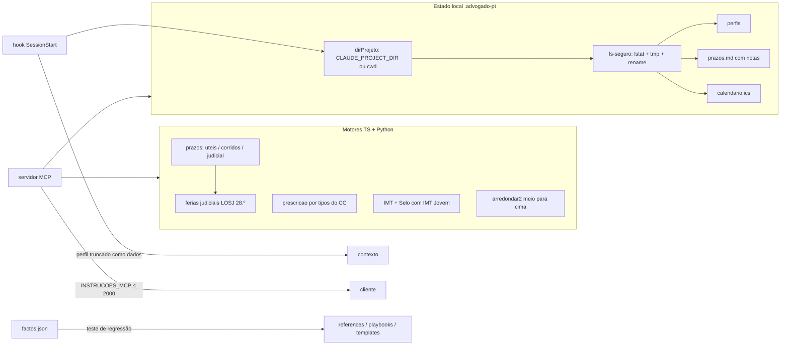

# Design: advogado-pt v1.2.1 correções

## Visão Geral
Correção em seis frentes, sem funcionalidades novas e sem mudar nomes de tools:
1. **Motores** — `contarPrazo` ganha o tipo `judicial` (art. 138.º CPC + férias judiciais da LOSJ) e a transferência do termo em `corridos`; a prescrição é reescrita por tipos do CC (309.º, 310.º, 316.º-317.º presuntivas); o IMT Jovem passa a isentar o Imposto do Selo; o IRS simplificado usa os coeficientes certos; a injunção deixa de ter teto nas transações comerciais. Tudo em TypeScript e Python, com casos de referência partilhados.
2. **Conteúdo** — correções jurídicas em references, playbooks, SKILL.md e templates, cada uma protegida por um facto em `factos.json` (o erro antigo em `naoContem`).
3. **Escrita segura** — um módulo único de escrita (`fs-seguro.ts`) recusa symlinks/junctions, grava por ficheiro temporário + renomeação e resolve sempre o mesmo diretório de projeto que o hook.
4. **Hook** — perfil injetado com limites e como dados; deteção do ponto de entrada por caminho real; MultiEdit analisado; leitura de ficheiros com teto de tamanho.
5. **Distribuição** — description da skill ≤ 1024, instruções MCP ≤ 2000 (persona completa só no prompt), `/doctor` → `/diagnostico`, `${CLAUDE_PLUGIN_ROOT}` nos commands, `.skill` com a pasta na raiz, SDK do MCP atualizado.
6. **Manutenção** — arredondamento único (meio para cima) nos dois lados, decisor de IVA com os mesmos textos, testes em falta, perfil genérico nas referências, integrações geradas a partir de uma fonte.

## Arquitetura

## Reutilização e Integração
| Tipo | O quê | Onde | Notas |
|---|---|---|---|
| Estender | `contarPrazo` (+ `judicial`, transferência em `corridos`) | `mcp-server/src/calculators/prazos.ts`, `skills/advogado-pt/scripts/prazos.py` | Reutiliza `feriadosNacionais`/`domingoPascoa` para as férias da Páscoa |
| Reescrever | Tabela de tipos de prescrição | `calculators/prescricao.ts`, `scripts/prescricao.py` | Mantém os ids existentes; muda prazos e bases |
| Estender | `calcularIMT` com Selo do IMT Jovem | `calculators/imt.ts`, `scripts/imt.py` | — |
| Corrigir | Coeficientes do IRS | `calculators/irs.ts`, `scripts/irs_simplificado.py` | — |
| Novo | `fs-seguro.ts` (escrita segura + `dirProjeto`) | `mcp-server/src/fs-seguro.ts` | Usado por `perfil.ts`, `prazos-estado.ts`, `calendario.ts` |
| Novo | `arredondar.ts` (r2 meio para cima) | `mcp-server/src/calculators/arredondar.ts` | Substitui os três `r2` locais; Python já usa `Decimal` |
| Estender | Hook: perfil limitado, realpath, MultiEdit | `hooks/advogado-hook.mjs` | Continua sem dependências e fail-open |
| Novo | `INSTRUCOES_MCP` | `mcp-server/src/persona.ts`, `index.ts` | A `PERSONA` passa só para o prompt `advogado_pt` |
| Novo | Gerador das integrações | `mcp-server/scripts/gerar-integracoes.mjs` | Escreve as instruções entre marcadores; teste verifica que estão em dia |
| Renomear | `commands/doctor.md` → `commands/diagnostico.md` | `commands/` | Hook, README e testes atualizados |
| Estender | Validação da skill no build | `build.py`, `mcp-server/test/plugin.test.mjs` | name, description ≤ 1024, sem `<`/`>`, sem `bin/` |
| Estender | Factos de referência | `mcp-server/test/factos.json` + `mcp-server/test/v121.test.mjs` | Ids com prefixo `v121-`, agrupados por tema |

## Alternativas e Compromissos
| Decisão | Opção | Prós | Contras | Custo de errar | Escolhida |
|---|---|---|---|---|---|
| Tipo por defeito de `calc_prazo` | `corridos` | Nunca dá uma data posterior à legal (judicial e úteis são sempre ≥) | Pode antecipar o prazo | Baixo: o utilizador age mais cedo | ✓ |
| Tipo por defeito de `calc_prazo` | tornar `tipo` obrigatório | Obriga a escolher | Quebra quem chama sem `tipo` | Médio | ✗ |
| Tipo por defeito de `calc_prazo` | manter `uteis` | Sem mudança | Dá datas depois do fim do prazo judicial | Alto | ✗ |
| Férias judiciais | Calcular no motor (LOSJ, art. 28.º) | Determinístico, testável | Não cobre suspensões excecionais | Médio, mitigado por nota | ✓ |
| Férias judiciais | Só avisar no texto | Simples | O modelo esquece-se | Alto | ✗ |
| Escrita segura | `lstat` em cada componente + tmp + `rename` | Sem dependências; atómico | Não protege contra corrida entre verificação e escrita (TOCTOU) | Baixo em uso local | ✓ |
| Escrita segura | `O_NOFOLLOW` | Fecha o TOCTOU | Não existe no Windows | — | ✗ |
| Instruções MCP | Texto curto de encaminhamento + persona no prompt | Cabe no limite; menos tokens em todas as sessões | A persona só entra quando o prompt é usado ou a skill dispara | Baixo | ✓ |
| Integrações | Gerar a partir de `persona.ts` | Uma fonte; teste de sincronia | Mais um script | Baixo | ✓ |
| Integrações | Editar à mão | Nenhum código | Desatualizam (já aconteceu) | Médio | ✗ |
| Regressão do conteúdo | Factos (`contem`/`naoContem`) por correção | Já existe; falha com o id | Só verifica texto, não raciocínio | Baixo | ✓ |

## Modelos de Dados
- **Prazo** (`contarPrazo`): entrada `{inicio: Date, dias: number (0..3650), tipo: "uteis" | "corridos" | "judicial", urgente?: boolean}`; saída `{dataLimite: Date, dataLegal?: Date, suspensoEmFerias: number (dias), nota: string}`.
- **Prescrição**: `{tipo, descricao, anos | meses, base, presuntiva: boolean, aviso?: string}`; tipos: `civil-geral` 20a (309.º), `creditos-comerciais` 20a (309.º), `prestacoes-periodicas` 5a (310.º, al. g)), `rendas` 5a (al. b)), `juros` 5a (al. d)), `servicos-profissionais` 2a presuntiva (317.º, al. c)), `vendas-a-consumidor` 2a presuntiva (317.º, al. b)), mais os existentes não afetados.
- **IMT**: `{imt, selo, total, isento, regime}` — `selo` = 0,8% × base, com base 0 (isenção total IMT Jovem) ou o excesso sobre o limite (isenção parcial).
- **prazos.md**: linhas de prazo `- [ ] AAAA-MM-DD — descrição — origem`; tudo o resto é preservado na posição original; os prazos são reescritos no bloco onde estava o primeiro prazo.
- **factos.json**: mantém o esquema; ids novos com prefixo `v121-<tema>-…`.

## Contratos de API
Tools MCP (nomes e parâmetros existentes mantêm-se):
- `calc_prazo {inicio, dias, tipo?: "uteis" | "corridos" | "judicial" = "corridos", urgente?: boolean}` → texto com a data-limite, a data legal se houve transferência, os dias suspensos em férias e a regra aplicada.
- `calc_prescricao {inicio, tipo}` — tipos novos `prestacoes-periodicas`, `juros`, `vendas-a-consumidor`; a resposta avisa quando a prescrição é presuntiva.
- `calc_imt` — `selo` e `total` com a isenção do IMT Jovem.
- Command `/doctor` passa a `/diagnostico`.
- CLI: `calc prazo --tipo judicial [--urgente]`; erros com código de saída 2 e mensagem que nomeia o argumento.

## Tratamento de Erros
- Datas: validação estrita AAAA-MM-DD com verificação de calendário (`2026-02-30` recusada) num helper único usado por tools e CLI.
- Montantes: `z.number().finite().nonnegative()` nas tools; no CLI, `num()` recusa `NaN` e negativos onde não fazem sentido.
- Todas as tools dentro de `try/catch` com mensagem curta; sem stack trace nem caminhos internos.
- Hook: qualquer erro → sem saída e código 0 (fail-open); leitura de `prazos.md` e do perfil limitada a 256 KB.

## Riscos
| Risco | Probabilidade | Impacto | Mitigação | Responsável |
|---|---|---|---|---|
| Uma correção jurídica nova também está errada | média | alto | Cada correção é reconfirmada em fonte oficial na tarefa; facto com fonte; "(a confirmar)" quando não se confirma | Claude |
| Mudar o tipo por defeito de `calc_prazo` surpreende quem o usava | baixa | médio | Default `corridos` é conservador; a resposta explica a regra e o tipo usado | Claude |
| Atualizar o SDK do MCP muda comportamento | baixa | médio | Smoke + suite completa contra o bundle; versão fixada no lock | Claude |
| `.skill` rejeitado no upload por estrutura | média | médio | Seguir a estrutura do empacotador oficial; validar `name` e `description` no build | Carlos (upload manual) |
| Renomear `/doctor` quebra hábitos | baixa | baixo | O nativo já o tapava; CHANGELOG e mensagem do hook indicam `/diagnostico` | Claude |

## Verificação da Constituição
- **1. Ponto único de verdade:** montantes duplicados passam a remissões, com teste que compara os restantes com `valores-2026.md` (US-10.AC-3). ✓
- **2. Anti-alucinação:** cada correção reconfirmada em fonte oficial; o que não se confirma fica "(a confirmar)" (US-4.AC-7). ✓
- **3. Calculadoras nos dois lados:** prazos, prescrição, IMT, IRS e injunção corrigidos em Python e TS, com casos partilhados (US-9.AC-1). ✓
- **4. Cross-refs reais:** `/diagnostico` e os caminhos `${CLAUDE_PLUGIN_ROOT}` validados pelo `plugin.test.mjs`. ✓
- **5. Zero custo e zero dependências novas:** só atualização de dependências existentes; hook sem dependências; teste contra `bin/`. ✓
- **6. Estilo da casa:** mantém-se; o teste T-21/T-22/T-29 continua a correr. ✓

## Rastreio de Complexidade
- `fs-seguro.ts` acrescenta um módulo, mas substitui três escritas diretas com a mesma regra.
- O gerador de integrações é um script de manutenção (não corre em runtime).

## Notas de Testabilidade
- **Costuras (seams):** `dirProjeto(opts)` aceita `projeto`/`home` explícitos (já usado nos testes); `contarPrazo` e `calcularIMT` são puros; o hook exporta as funções puras.
- **Determinismo:** datas fixas nos testes (`2026-10-01`, `2026-07-01`); `hoje` injetado; feriados e férias calculados a partir do ano.
- **Efeitos secundários a isolar:** escrita em pastas temporárias (`mkdtemp`); symlinks criados no teste (no Windows, junction de diretório com `symlinkSync(…, "junction")`, que não exige privilégios).
- **Estratégia de dados de teste:** `mcp-server/test/fixtures/paridade.json` com casos lidos pelos testes TS e Python; factos com prefixo `v121-`.

## [SEC] Modelo de Ameaças
Fronteiras de confiança: (1) ficheiros do projeto aberto (podem vir de um repositório de terceiros), (2) argumentos das tools MCP (vêm do modelo), (3) cliente MCP local (stdio).

| STRIDE | Ameaça | Mitigação | AC |
|---|---|---|---|
| Spoofing | n/a — servidor local por stdio, sem rede nem contas | — | — |
| Tampering | `.advogado-pt/` ou `prazos.md` como symlink/junction para um ficheiro do utilizador (ex.: `.bashrc`) → sobrescrita | `lstat` em cada componente, recusa de links, tmp + `rename` | US-6.AC-10 |
| Tampering | Perfil de um repositório clonado com texto do tipo "SYSTEM: ignora…" injetado no contexto | Campos ≤ 200, total ≤ 1500, sem quebras de linha, rotulado como dados | US-6.AC-11 |
| Repudiation | n/a — utilizador único, sem ações com efeitos para terceiros | — | — |
| Information disclosure | Resource `advogado-pt://../README` lê ficheiros fora de `content/` | Lista fechada de categorias e nome `^[a-z0-9-]+$` | US-6.AC-12 |
| Information disclosure | Erros com stack trace ou caminhos internos | Mensagens curtas | US-6.AC-14 |
| Denial of service | `calc prazo --inicio amanha` em ciclo infinito; `dias` enorme; `prazos.md` gigante | Datas validadas, `dias` ≤ 3650, leitura ≤ 256 KB | US-1.AC-4, US-7.AC-1 |
| Elevation of privilege | Escrita através de symlink para um script de arranque → execução de código | Igual ao Tampering acima | US-6.AC-10 |

## [SEC] Requisitos de Segurança
- Nível alvo: **OWASP ASVS L1** (ferramenta local, sem rede, sem contas), com V5 (validação de entradas), V12 (ficheiros) e V14 (dependências) como capítulos relevantes.
- Validação de todas as entradas das tools com zod (tipos, intervalos, formatos) e no CLI com um helper estrito.
- Escrita só dentro de `<projeto>/.advogado-pt/` ou `~/.advogado-pt/`, sem seguir links.
- Dependências sem vulnerabilidades altas no `npm audit --omit=dev`.

## [SEC] Autenticação e Autorização
Não aplicável: o servidor corre localmente por stdio para um único utilizador e não expõe endpoints de rede; a autorização é a do sistema de ficheiros do utilizador. O único controlo de acesso relevante é o confinamento da escrita e da leitura a pastas conhecidas (ver Modelo de Ameaças).

## [SEC] Gestão de Segredos e Chaves
O plugin não trata segredos: não pede nem guarda tokens, palavras-passe ou chaves (US-6.AC-14). Os ficheiros `.advogado-pt/` têm só campos do perfil e prazos; não há variáveis de ambiente secretas. O teste T-217 procura padrões de segredos (`token`, `password`, `api_key`, chaves PEM) nos ficheiros gerados e nas respostas de erro.

## [SEC] Testes de Segurança
- Testes de casos de abuso (T-213 a T-217): symlink/junction em `.advogado-pt/` e no ficheiro de destino; perfil com 21 KB e instruções; resource com `..`; erros sem stack trace.
- `npm audit --omit=dev` sem vulnerabilidades altas (T-226), corrido localmente.
- Scan SAST/segredos local com o dev-guardian antes do push (opcional, sem custo).
