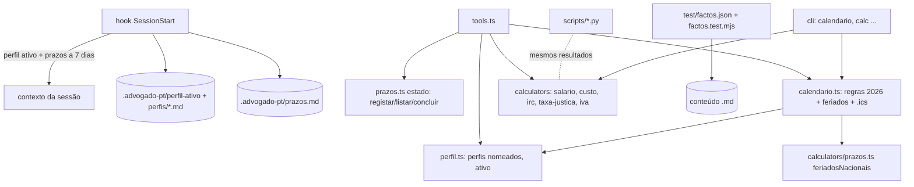

# Design: advogado-pt v1.2 operacional

## Visão Geral
Três blocos sobre a arquitetura da v1.1, sem infraestrutura nova:

1. **Estado local do utilizador** (`.advogado-pt/`): o perfil passa a suportar vários perfis nomeados com um ativo; junta-se `prazos.md` (prazos em curso) e `calendario-<ano>.ics` (exportação). Tudo em Markdown/texto simples, editável à mão, lido pelo servidor MCP e pelo hook (que continua sem dependências e fail-open).
2. **Motores determinísticos** (Python + TypeScript, mesmos resultados): salário líquido, custo do trabalhador, IRC, taxa de justiça e decisor de IVA em operações internacionais; mais o gerador de calendário (só TS + CLI: não é uma calculadora de valores).
3. **Conteúdo** (subagentes em paralelo, revisto): compliance (RGPC/denúncias), empregador, IVA internacional, contratos/societário, tribunais, setores regulados, IA/videovigilância; e a resolução dos 18 valores e 4 pontos de doutrina a partir da investigação já feita.

Os dados que mudam por ano (tabelas de retenção, taxas de IRC, tabela do RCP, prazos do calendário) vivem embebidos nos motores (como a tabela de juros da v1.1) com a fonte de cada linha, e resumidos em `valores-2026.md`.

## Arquitetura


## Reutilização e Integração
| Tipo | O quê | Onde (caminho) | Porquê / notas |
|---|---|---|---|
| Estender | Perfil: perfis nomeados, perfil ativo, listar | `mcp-server/src/perfil.ts`, `hooks/advogado-hook.mjs` | Mesmo formato `campo: valor`; `perfil-empresa.md` continua a ser o perfil por defeito |
| Estender | Feriados nacionais (exportar `feriadosNacionais`, `ehDiaUtil`) | `mcp-server/src/calculators/prazos.ts` | Reutilizados pelo calendário para a transferência de prazos |
| Estender | Hook SessionStart: aviso de prazos | `hooks/advogado-hook.mjs` | Parser mínimo de `prazos.md` duplicado (o hook não importa o servidor) |
| Estender | Tools, CLI, índices, SKILL.md, README | `tools.ts`, `cli/advogado-pt.mjs`, READMEs | Mesmo padrão |
| Novo | `calendario.ts` (regras, gerar, ics) | `mcp-server/src/calendario.ts` | Não existe nada equivalente; regras numa tabela declarativa |
| Novo | `prazos-estado.ts` (ficheiro de prazos) | `mcp-server/src/prazos-estado.ts` | `calculators/prazos.ts` conta prazos, não os guarda |
| Novo | Calculadoras `salario.ts`, `irc.ts`, `taxa-justica.ts`, `iva.ts` + Python | `calculators/`, `scripts/` | Nenhuma existente cobre estes cálculos |
| Novo | Factos de referência | `mcp-server/test/factos.json`, `factos.test.mjs` | Regressão jurídica determinística |
| Reutilizar | `formatarEuros`, `parseData`, `AVISO`, `lerAmbito` | `format.ts`, `tools.ts`, `content.ts` | — |

**Fronteiras:** os motores são puros; só `perfil.ts`, `prazos-estado.ts` e `calendario.ts` (exportação) escrevem, e só em `<dir>/.advogado-pt/` com nomes fixos ou validados (`[a-z0-9-]+`).

## Alternativas e Compromissos
| Decisão | Opção | Prós | Contras | Custo se errada | Escolhida |
|---|---|---|---|---|---|
| Exportar para Google Calendar | Ficheiro `.ics` (RFC 5545) | Funciona em qualquer calendário, sem credenciais, zero dependências | Importação manual | Baixo | ✓ |
| Exportar para Google Calendar | API Google | Automático | OAuth, dependência, custo, só Google | Alto | ✗ — com um conector de calendário ativo o assistente cria os eventos a partir da lista |
| Regras do calendário | Tabela declarativa no código, com fonte por regra | Testável, determinística | Atualização anual em código | Médio | ✓ |
| Regras do calendário | Pedir ao modelo para gerar | Flexível | Não determinístico, inventa datas | Alto | ✗ |
| Prazos em curso | `prazos.md` no projeto | Legível, versionável pelo utilizador | Parser simples | Baixo | ✓ |
| Vários perfis | `perfis/<nome>.md` + ficheiro `perfil-ativo` | Retrocompatível com `perfil-empresa.md` | Mais um ficheiro | Baixo | ✓ |
| Vários perfis | Um único ficheiro com várias secções | Um ficheiro | Edição manual mais difícil, conflitos | Médio | ✗ |
| Tabelas de retenção | Embebidas por escalão com fonte (Despacho 2026) | Determinístico, igual nos 2 lados | Atualizar todos os anos | Médio — testes por escalão | ✓ |
| Regressão jurídica | Factos verificados testados por `node:test` | Zero custo, determinístico | Não testa o raciocínio do modelo | Baixo | ✓ |
| Regressão jurídica | Avaliação por LLM | Testa respostas | Custo, não determinístico | Médio | ✗ (constituição: zero custo) |

## Modelos de Dados
```typescript
// perfil.ts (extensão)
interface OpcoesPerfil { projeto?: string; home?: string; hoje?: Date; perfil?: string } // perfil = nome nomeado
function listarPerfis(opts): Array<{ nome: string; origem: "projeto" | "geral"; ativo: boolean }>;
function ativarPerfil(nome: string, destino: "projeto" | "geral", opts): void; // escreve .advogado-pt/perfil-ativo

// prazos-estado.ts — linha: "- [ ] 2026-10-20 — Oposição à execução fiscal — art. 203.º CPPT"
interface PrazoRegistado { data: string; descricao: string; origem?: string; concluido: boolean }
function lerPrazos(dir): PrazoRegistado[]; function registarPrazo(p, dir): void; function concluirPrazo(data, descricao, dir): boolean;
function prazosProximos(prazos, hoje, dias = 7): { vencidos: PrazoRegistado[]; proximos: Array<PrazoRegistado & { faltam: number }> };

// calendario.ts
interface RegraObrigacao {
  id: string; titulo: string; area: "fiscal" | "seg-social" | "societario" | "laboral" | "compliance";
  aplica(p: CamposPerfil): boolean | "?"; camposNecessarios: string[];
  datas(ano: number): Date[];             // datas legais antes da transferência
  transferencia: "dia-util-seguinte" | "nenhuma";
  base: string; fonte: string;
}
interface Obrigacao { id: string; titulo: string; data: string; dataOriginal?: string; base: string; aConfirmar: boolean; camposEmFalta: string[] }
function gerarCalendario(ano: number, perfil: CamposPerfil | null): Obrigacao[];
function paraICS(obrigs: Obrigacao[], ano: number): string; // CRLF, line folding 75 octetos, escape , ; \

// calculadoras (TS; Python igual em snake_case)
calcularSalarioLiquido({ bruto, tabela: "I"|"II"|"III", dependentes, subsidioRefeicaoDia?, diasRefeicao?, refeicaoCartao? })
  -> { segurancaSocial, taxaIRS, retencaoIRS, refeicaoTributavel, liquido }
calcularCustoTrabalhador({ base, diuturnidades?, subsidioRefeicaoDia?, diasRefeicao?, refeicaoCartao?, taxaSeguroAT? })
  -> { retribuicaoAnual, tsuAnual, refeicaoAnual, seguroAnual, total, mensalMedio }
calcularIRC({ lucroTributavel, prejuizosDedutiveis?, pme, derramaMunicipal, tributacaoAutonoma? })
  -> { materiaColetavel, ircTaxaReduzida, ircTaxaNormal, irc, derramaMunicipal, derramaEstadual, tributacaoAutonoma, total }
calcularTaxaJustica(valorAcao) -> { uc, taxaUC, taxaEuros, escalao }
decidirIVA({ tipo: "bens"|"servicos", cliente: "empresa"|"consumidor", destino: "PT"|"UE"|"fora-UE", nifVIES?, vendasDistanciaUE?, servico?: "geral"|"eletronico"|"imovel"|"evento"|"transporte-passageiros"|"restauracao" })
  -> { tributacao, liquida, mencaoFatura, declaracoes: string[], base: string }
```

## Contratos de API
Tools MCP novas: `calendario_obrigacoes {ano, exportar?, diretorio?, perfil?}`, `registar_prazo {data, descricao, origem?, diretorio?}`, `listar_prazos {diretorio?}`, `concluir_prazo {data, descricao, diretorio?}`, `listar_perfis {diretorio?}`, `ativar_perfil {nome, destino?, diretorio?}`, `calc_salario_liquido`, `calc_custo_trabalhador`, `calc_irc`, `calc_iva_operacao`, `calc_taxa_justica`. Alteradas (aditivo): `obter_perfil_empresa` e `guardar_perfil_empresa` aceitam `perfil?`. CLI: `calendario --ano 2026 [--ics]`, `calc salario|custo|irc|iva|taxa-justica`.

## Considerações de Segurança
- Escrita só em `<dir>/.advogado-pt/` com nomes fixos (`prazos.md`, `perfil-ativo`, `calendario-<ano>.ics`) ou validados (`perfis/<nome>.md`, `nome` ∈ `[a-z0-9][a-z0-9-]{0,40}`); `diretorio` resolvido e tem de existir.
- Campos de texto normalizados para uma linha (sem injeção de linhas nos ficheiros).
- `.ics`: escape de `\`, `;`, `,` e quebras de linha nos campos de texto.

## Tratamento de Erros
Erros de domínio com mensagem PT que nomeia o campo; tools devolvem a mensagem; CLI sai com código 1; hook nunca lança.

## Riscos
| Risco | Probabilidade | Impacto | Mitigação | Responsável |
|---|---|---|---|---|
| Tabelas de retenção/IRC/RCP de 2026 mal transcritas | média | alto | Dados recolhidos com URL por linha; casos de teste por escalão nos 2 lados; marca "estimativa" | Claude |
| Data do calendário errada (regra mal lida ou alterada em 2026) | média | alto | Regras com base legal e fonte por linha; teste por obrigação; aviso "confirmar no Portal das Finanças" | Claude |
| Decisor de IVA simplifica exceções | média | médio | Só cobre os cenários pesquisados; fora deles devolve "regime especial — confirmar" | Claude |
| Volume de conteúdo (≈ 25 ficheiros) com erros de subagentes | média | alto | Briefing com rigor; revisão das citações determinantes; factos de regressão | Claude + utilizador |
| Pontos de doutrina sem resposta definitiva | alta | médio | Documentar posição + grau de certeza + cláusula mais segura, nunca afirmar como certo | Claude |

## Verificação da Constituição
- [x] P1 Ponto único de verdade — valores anuais resumidos em `valores-2026.md`; tabelas detalhadas embebidas nos motores com fonte (padrão da v1.1).
- [x] P2 Anti-alucinação — todos os dados vêm da investigação com URL; o que não se confirma fica `[VERIFICAR]`.
- [x] P3 Calculadoras nos dois lados — salário, custo, IRC, taxa de justiça e IVA em Python e TS com os mesmos casos.
- [x] P4 Cross-refs reais — índices e commands validados pelos testes de estrutura.
- [x] P5 Zero custo / sem dependências — `.ics` gerado à mão; hook sem dependências e fail-open.
- [x] P6 Estilo da casa — conteúdo novo com âmbito, "Antes de enviar" e house style (testes T-21/T-22/T-29 da v1.1 cobrem-no).

## Rastreio de Complexidade
| O quê | Porque é preciso | Alternativa mais simples rejeitada porque |
|---|---|---|
| Parser de `prazos.md` e do perfil ativo duplicado no hook | O hook não importa o servidor (só `dist/index.js` é versionado) | Importar `dist/*.js`: não existe numa instalação do marketplace |
| Calendário só em TS (sem Python) | Não é uma calculadora de valores; o CLI usa o TS compilado | Port Python: duplicação sem uso |

## Notas de Testabilidade
- **Costuras:** todas as funções recebem `hoje`, `projeto`, `home`; `gerarCalendario(ano, perfil)` é pura.
- **Determinismo:** datas explícitas; `.ics` com `DTSTAMP` derivado de `hoje` passado por parâmetro.
- **Efeitos secundários:** ficheiros em `mkdtempSync`; CLI por `spawnSync`.
- **Dados de teste:** casos de referência calculados à mão a partir das tabelas oficiais (registados no test-plan).
