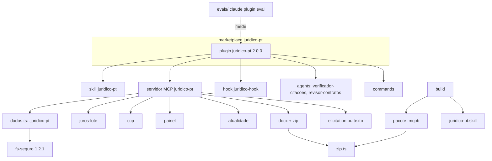

# Design: juridico-pt v2.0

## Visão Geral
Duas partes, pela ordem:
1. **Renomeação direta (US-1)** — tudo o que se chama `advogado-pt` passa a `juridico-pt` (plugin, marketplace, servidor MCP, pasta da skill, CLI, hook, URI dos resources, `.skill`, repositório). Os dados do utilizador passam a `.juridico-pt/`. Sem migração automática: o plugin só tem um utilizador, que troca a instalação e renomeia a pasta à mão seguindo o CHANGELOG (D-1). A persona deixa de dizer "advogado" e passa a "assistente jurídico" (Lei 10/2024).
2. **Funcionalidades (US-2 a US-11)** — conteúdo (faturação 2027, PEPEX, NIS2, fundos, CCP, templates), motores novos nos dois lados (`calc_juros_lote`, `calc_procedimento_ccp`), módulos novos só em TS (painel, atualidade, `.docx`, ZIP, `.mcpb`, migração), dois subagentes, avaliações `claude plugin eval`, elicitation com recurso a texto, e redução do custo fixo por sessão.

Uma **investigação inicial** (tarefa 2) confirma na documentação oficial quatro mecanismos antes de os usar: renomear um marketplace instalado, o formato do `claude plugin eval`, o manifesto `.mcpb` e a elicitation no SDK do MCP. Cada um tem uma alternativa de recurso abaixo.

## Arquitetura

## Reutilização e Integração
| Tipo | O quê | Onde | Notas |
|---|---|---|---|
| Renomear | Plugin, marketplace, servidor, skill, CLI, hook, URI | `.claude-plugin/`, `skills/juridico-pt/`, `mcp-server/src/index.ts`, `cli/juridico-pt.mjs`, `hooks/juridico-hook.mjs`, `resources.ts` | `cli/advogado-pt.mjs` fica como atalho que avisa e reencaminha durante a 2.x |
| Novo | `dados.ts` (pasta de dados `.juridico-pt/`; `JURIDICO_PT_HOME`) | `mcp-server/src/dados.ts` | Usado por perfil, prazos, calendário, painel e exportação; reutiliza `fs-seguro` |
| Estender | `memoriaJuros` → `calcularJurosLote` | `calculators/juros-lote.ts`, `scripts/juros_mora.py` | Mesmas taxas semestrais |
| Novo | `calc_procedimento_ccp` | `calculators/ccp.ts`, `scripts/procedimento_ccp.py` | Limiares do DL 177/2026 com fonte |
| Estender | Calendário com campos novos do perfil (IMI, IUC, período de tributação) e evento das faturas em PDF | `calendario.ts` | Regras novas com fonte |
| Estender | Prazos com perfil e conservação de 12 meses | `prazos-estado.ts` | Linha `… — perfil: <nome>` |
| Novo | `painel.ts`, `atualidade.ts`, `docx.ts`, `zip.ts`, `elicitacao.ts` | `mcp-server/src/` | Sem dependências |
| Novo | `build-mcpb.mjs` | `mcp-server/scripts/` | Usa `zip.ts` compilado |
| Novo | Subagentes | `agents/verificador-citacoes.md`, `agents/revisor-contratos.md` | Só leitura |
| Novo | Avaliações | `evals/` | Casos derivados dos factos e de cenários |
| Estender | Hook SessionStart curto fora de projetos com `.juridico-pt/` + aviso de atualidade | `hooks/juridico-hook.mjs` | — |
| Novo | Conteúdo | `references/{faturacao,fundos-europeus,privacidade-plugin}.md`, playbooks, checklists, templates | Estilo da casa, `Âmbito:` |

## Alternativas e Compromissos
| Decisão | Opção | Prós | Contras | Custo de errar | Escolhida |
|---|---|---|---|---|---|
| Migração de quem tem `advogado-pt` | Nenhuma: passos manuais no CHANGELOG | Zero código de transição | O utilizador reinstala e renomeia a pasta | Baixo (um só utilizador) | ✓ (D-1) |
| Migração | Mapa `renames` no marketplace.json ou plugin legado 1.2.2 com aviso | Migração automática ou guiada | Código e testes de transição sem utilizadores para os justificar; o `renames` não atravessa a mudança de nome do marketplace | Baixo | ✗ |
| Migração | Manter `advogado-pt` como alias completo | Zero esforço do utilizador | Duas cópias a manter; o nome "advogado" continua | Alto (Lei 10/2024) | ✗ |
| Migração | Só nota no README | Simples | Ninguém lê | Alto | ✗ |
| Nome do marketplace | `juridico-pt` | Coerente com o nome novo | Exige remover o marketplace antigo e adicionar o novo (documentado no CHANGELOG) | Baixo (um só utilizador) | ✓ (D-1) |
| Pasta de dados | `.juridico-pt/`, renomeada à mão | Simples e coerente | O utilizador renomeia a pasta uma vez | Baixo | ✓ (D-1) |
| Pasta de dados | `.juridico-pt/` com leitura de `.advogado-pt/` e cópia na 1.ª escrita | Sem passos manuais | Código de transição para um só utilizador | Baixo | ✗ |
| `.docx` | Gerar OOXML + ZIP próprio (método store, CRC32) | Zero dependências (constituição 5) | Só um subconjunto de Markdown | Baixo | ✓ |
| `.docx` | Biblioteca `docx` no bundle | Formatação rica | Dependência nova | — | ✗ |
| Instalação no Desktop | `.mcpb` gerado pelo nosso `zip.ts` | Sem a CLI `mcpb` como dependência | Manter o manifesto à mão | Baixo | ✓ |
| Subagentes | Ficheiros `agents/` do plugin, só leitura | Nativos do Claude Code | Não existem noutras superfícies | Baixo (há o command como alternativa) | ✓ |
| Avaliações | `claude plugin eval` (oficial, local) | Compara com a base sem plugin; sem custo de infra | Custa tokens a correr | Baixo | ✓ |
| Custo por sessão | Linha curta fora de projetos com `.juridico-pt/` | Corta o custo em todas as sessões | Quem não tem perfil vê menos contexto | Baixo | ✓ |

## Modelos de Dados
- **Pasta de dados**: `<base>/.juridico-pt/{perfil-empresa.md, perfil-ativo, perfis/<nome>.md, prazos.md, calendario-<ano>[-<perfil>].ics, exportados/<nome>.docx}`; `.advogado-pt/` não é lida.
- **Prazo**: `- [ ] AAAA-MM-DD — descrição — origem — perfil: <nome>` (origem e perfil opcionais); `[x]` cumprido; cumpridos há mais de 12 meses removidos na escrita seguinte.
- **Perfil (campos novos)**: `cae`, `concelho`, `fim_periodo_tributacao` (MM-DD), `imoveis` (sim/não), `viaturas` (sim/não), `setor_nis2`, `vendas_b2c`, `trabalhadores_estrangeiros`, `emite_faturas`.
- **Juros em lote**: entrada `[{cliente, fatura, capital, vencimento, tipo?}]`, `data_fim?`; saída por fatura `{juros, dias, tramos, indemnizacao40, vencida}`, por cliente e total.
- **Procedimento CCP**: entrada `{valor, tipo: "bens-servicos" | "empreitada", entidade?: "setor-publico-administrativo" | "outra"}`; saída `{admissiveis: [{procedimento, ate, base}], notas}`.
- **Atualidade**: `[{item, fonte, ultimaAtualizacao, proximaRevisao, desatualizado}]`.
- **Avaliação**: casos em `evals/` com `prompt`, verificações determinísticas (`tool_used`, `contains`, `not_contains`) e rubrica opcional (formato exato confirmado na investigação).

## Contratos de API
Tools novas (MCP): `calc_juros_lote {faturas[], data_fim?}`, `calc_procedimento_ccp {valor, tipo, entidade?}`, `painel_clientes {dias?: 30, diretorio?}`, `verificar_atualidade {}`, `exportar_documento {conteudo | template, nome, diretorio?}`, `apagar_perfil {nome, destino?, diretorio?}`. Alteradas (aditivo): `registar_prazo {…, perfil?}`, `calendario_obrigacoes {…, por_perfil?}`, `guardar_perfil_empresa {…, acrescentar_gitignore?}`. Nomes das tools existentes mantêm-se. Servidor e URI dos resources: `juridico-pt` / `juridico-pt://` (o esquema `advogado-pt://` continua aceite na 2.x). Prompt `assistente_juridico` (substitui `advogado_pt`). Commands novos: `/faturacao`, `/painel`, `/exportar`. CLI: `cli/juridico-pt.mjs` com `calc lote`, `calc ccp`, `painel`, `exportar`, `atualidade`.

## Considerações de Segurança
- Toda a escrita nova (`.docx`, `.ics` por perfil, migração, `.gitignore`) passa por `fs-seguro` (sem links, tmp + rename) e fica dentro do projeto ou de `~/.juridico-pt/`.
- `apagar_perfil` só apaga ficheiros com nome validado dentro de `perfis/` e recusa links.
- O texto de documentos e perfis entra no contexto rotulado como dados; os subagentes são só de leitura.
- Nenhuma credencial: conectores de terceiros (faturação) são configurados pelo utilizador no cliente.

## Tratamento de Erros
- Migração: erro a copiar a pasta antiga → continua a ler a antiga e avisa; nunca apaga.
- Lote de juros: uma fatura inválida não estraga as outras (erro por linha).
- `.docx`: Markdown fora do subconjunto passa a texto simples; o ficheiro é sempre válido.
- Elicitation recusada ou não suportada → perguntas em texto (comportamento da 1.2).
- Subagente sem fonte → "não verificada".

## Riscos
| Risco | Probabilidade | Impacto | Mitigação | Responsável |
|---|---|---|---|---|
| A renomeação do marketplace parte a atualização de quem já instalou | certa | baixo (um só utilizador) | Passos de troca no CHANGELOG e no README (D-1) | Claude + Carlos |
| Renomear o repositório no GitHub (ação externa) | baixa | alto | Feito pelo Carlos ou com confirmação explícita; o GitHub redireciona o URL antigo | Carlos |
| Regras de faturação 2027 ou limiares do CCP mal transcritos | média | alto | Fonte oficial por regra; factos de referência; "(a confirmar)" quando não confirmado | Claude |
| `.docx` inválido em algum leitor | baixa | médio | Teste que valida a estrutura do ZIP e do XML; abrir no Word e no LibreOffice no quickstart | Claude |
| Avaliações caras ou instáveis | média | baixo | Conjunto pequeno com verificações determinísticas; corre só antes de lançar | Claude |

## Verificação da Constituição
- **1. Ponto único de verdade:** limiares do CCP e datas da faturação em `valores-2026.md`, com remissões. ✓
- **2. Anti-alucinação:** fonte por regra; subagente verificador; avaliação "não inventa normas". ✓
- **3. Calculadoras nos dois lados:** `calc_juros_lote` e `calc_procedimento_ccp` em Python e TS com os mesmos casos. Painel, atualidade, `.docx` e `.mcpb` não são calculadoras de valores (só TS + CLI, como o calendário). ✓
- **4. Cross-refs reais:** testes de commands, agents e conteúdo atualizados para os nomes novos. ✓
- **5. Zero custo e zero dependências novas:** `.docx`, ZIP e `.mcpb` com módulos próprios; hook sem dependências. ✓
- **6. Estilo da casa:** conteúdo novo com `Âmbito:` e "Antes de enviar — verificar". ✓
- A constituição e o CLAUDE.md passam a usar os nomes novos (`skills/juridico-pt/…`).

## Rastreio de Complexidade
- `zip.ts` é infraestrutura própria (≈100 linhas) para evitar uma dependência.

## Notas de Testabilidade
- **Costuras (seams):** `dados.ts` recebe `projeto`/`home`; `hoje` injetado no painel e na atualidade; `zip.ts` e `docx.ts` puros (bytes em memória).
- **Determinismo:** datas fixas; CRC32 verificado contra valores conhecidos; ordem fixa das entradas do ZIP.
- **Efeitos secundários a isolar:** escrita em pastas temporárias; nada de rede nos testes (as avaliações correm à parte).
- **Estratégia de dados de teste:** perfis e prazos de exemplo em `mcp-server/test/fixtures/contabilista/`; casos partilhados TS/Python para juros em lote e CCP.

## [AI] 1. Estratégia de Modelo
O plugin não chama modelos: corre dentro do cliente do utilizador (Claude Code, Desktop, claude.ai, outras IAs por MCP) e usa o modelo que ele escolheu. Os subagentes declaram `model: inherit` (herdam o do utilizador); o `verificador-citacoes` funciona com qualquer modelo com WebFetch/WebSearch. As avaliações correm com o modelo por defeito do Claude Code e registam qual foi.

## [AI] 2. Arquitetura de Prompt
Prompts como código, versionados no repositório e testados:
- **Instruções do servidor** (`INSTRUCOES_MCP`, ≤ 2000 caracteres): encaminhamento intenção → tool.
- **Persona** (prompt `assistente_juridico` e SKILL.md): papel de assistente jurídico, rigor, fluxo, aviso.
- **SKILL.md**: description ≤ 1024 com exclusões; corpo com tabelas de encaminhamento.
- **Commands** e **agents**: corpo curto que nomeia tools e ficheiros reais (validado por teste).
- Dados de terceiros (perfis, documentos colados, resultados de tools) entram sempre como dados delimitados, nunca como instruções.

## [AI] 3. Economia de Tokens
Custo fixo por sessão (medido na 1.2.1 e alvo da 2.0, num projeto sem `.juridico-pt/`):
- Description da skill: ~810 → ≤ 300 tokens (já na 1.2.1).
- Instruções MCP: ~1.000 (cortadas) → ≤ 550 tokens.
- SessionStart: ~250 → ≤ 60 tokens (uma linha) fora de projetos com dados.
- Listagem dos commands: ~1.500 tokens; descrições encurtadas para ≤ 150 caracteres.
- Alvo SC-003: menos de metade do texto fixo da 1.2.1. Medido por teste (contagem de caracteres como aproximação).

## [AI] 4. Orçamento de Latência
- Tools locais: < 100 ms (calculadoras, painel com 10 perfis < 300 ms).
- Hook SessionStart: < 300 ms (NFR-4).
- Exportação `.docx`: < 500 ms para 50 páginas.
- Subagente verificador: depende da web (minutos); corre em segundo plano quando o utilizador o pede.

## [AI] 5. Estratégia de Avaliação
Ver `eval-plan.md`: conjunto golden (≥ 30), adversarial (≥ 5) e de regressão (≥ 5) no formato do `claude plugin eval`; verificações determinísticas (tool usada, texto que tem de aparecer ou não) e rubrica "não inventa normas". Base: Claude sem o plugin. Limiares: escolha da tool ≥ 90%, sem normas inventadas ≥ 95%, melhor que a base em ambos (SC-002).

## [AI] 6. Segurança e Abuso
- **Injeção de instruções** por documentos colados, perfis de repositórios clonados ou resultados de páginas web (subagente): conteúdo tratado como dados; perfil limitado (1.2.1); subagentes só de leitura e sem ferramentas de escrita.
- **Exercício ilegítimo de atos de advogado**: persona de assistente jurídico; aviso para consultar advogado quando há prazo judicial, processo penal ou risco elevado.
- **Jurisdição errada**: a description exclui outros países (ex.: Brasil); caso adversarial na avaliação.
- **Pedidos de fraude** (ex.: datar documentos para trás, esconder bens a credores): recusa e explicação; caso adversarial.

## [AI] 7. Fallback e Degradação
- Sem servidor MCP (claude.ai, `.skill`): scripts Python e cálculo manual marcado como estimativa (tabela de superfícies do SKILL.md).
- Sem elicitation: perguntas em texto.
- Sem acesso web: citações "não verificadas"; marca "(a confirmar)".
- Sem conector de faturação: o utilizador cola a lista de faturas.

## [AI] 8. Observabilidade de IA
Sem telemetria (privacidade e zero custo). A observabilidade é offline: relatório das avaliações guardado em `.specs/juridico-pt-v2-0/` com o modelo e a data; factos de referência nas suites; aviso de atualidade no início da sessão.

## [AI] 9. Ciclo de Vida do Modelo
Reavaliar com `claude plugin eval` (a) antes de cada versão, (b) quando sair um modelo novo por defeito no Claude Code, (c) depois da atualização anual dos valores (janeiro). Uma descida abaixo dos limiares bloqueia o lançamento. A base (sem plugin) é refeita com o mesmo modelo.

## [AI] 10. Multimodalidade (se aplicável)
Não aplicável ao plugin: o utilizador pode colar ou anexar PDFs de notificações, que o cliente lê; o plugin não processa imagens nem áudio. A exportação produz `.docx` (texto).

## [PRIVACY] Inventário de Dados Pessoais
| Dado | Onde | Titulares | Categoria |
|---|---|---|---|
| Perfil da própria empresa (forma, setor, n.º de trabalhadores, volume de negócios…) | `.juridico-pt/perfil-empresa.md` | o empresário quando é ENI | identificação/atividade económica |
| Perfis de clientes (modo contabilista) | `.juridico-pt/perfis/<nome>.md` | clientes ENI (pessoas singulares) | idem |
| Prazos (descrição, origem, perfil) | `.juridico-pt/prazos.md` | podem referir pessoas (contrapartes, trabalhadores) | dados de processos |
| Calendários `.ics` | `.juridico-pt/calendario-*.ics` | indireto (perfil) | obrigações legais |
| Documentos exportados | `.juridico-pt/exportados/*.docx` | partes dos documentos | variável (contratos, cartas) |
| Conversa | fornecedor do modelo (fora do plugin) | qualquer pessoa referida | variável |

Sem categorias especiais guardadas pelo plugin; o template de perfil recusa NIF de pessoas e dados de trabalhadores.

## [PRIVACY] Fundamento de Licitude e Finalidade
O plugin é uma ferramenta local: quem trata os dados é o utilizador (responsável pelo tratamento). Finalidades: adaptar as respostas ao perfil, lembrar prazos e produzir documentos. Fundamento típico do utilizador: execução de contrato (art. 6.º, n.º 1, al. b), RGPD) com os seus clientes, ou interesse legítimo (al. f)) no caso da própria empresa. O plugin não envia os ficheiros a ninguém; o conteúdo que o utilizador mostra ao modelo segue o contrato dele com o fornecedor do modelo.

## [PRIVACY] Conservação e Eliminação
- Prazos cumpridos: retirados de `prazos.md` 12 meses depois de cumpridos (US-11.AC-5).
- Perfis, calendários e documentos: até o utilizador os apagar; perfil sem atualização há mais de 12 meses assinalado no início da sessão.
- Pasta antiga `.advogado-pt/`: o plugin nunca a lê nem a apaga; o CHANGELOG diz ao utilizador para a renomear para `.juridico-pt/`.
- Eliminação: `apagar_perfil` (perfil + prazos associados); ficheiros simples apagáveis à mão.

## [PRIVACY] Direitos dos Titulares dos Dados
- Acesso e portabilidade: os dados estão em Markdown/texto legível, copiáveis tal como estão.
- Retificação: editar o ficheiro ou `guardar_perfil_empresa`.
- Apagamento: `apagar_perfil` e apagamento manual da pasta.
- Oposição/limitação: o utilizador deixa de guardar o perfil (o plugin funciona sem perfil).
O exercício perante o contabilista ou a empresa é responsabilidade deles; o plugin dá os meios técnicos.

## [PRIVACY] Subcontratantes e Transferências Internacionais
O plugin não usa subcontratantes nem transfere dados. O fornecedor do modelo (ex.: Anthropic) é escolhido e contratado pelo utilizador; conectores de terceiros (programa de faturação) também. A referência `privacidade-plugin` e o README dizem isto e recomendam ao contabilista um acordo de tratamento de dados com o fornecedor do modelo e a informação aos clientes.

## [PRIVACY] AIPD (quando obrigatória — art. 35.º)
O plugin, em si, não exige AIPD (ferramenta local, sem perfis automatizados com efeitos jurídicos, sem grande escala). Um contabilista ou empresa que use IA para tratar dados de muitos clientes deve avaliar a necessidade (lista da CNPD, Regulamento 798/2018); a checklist RGPD existente remete para isso. Decisão registada aqui; revista se o plugin passar a guardar dados de categorias especiais.
